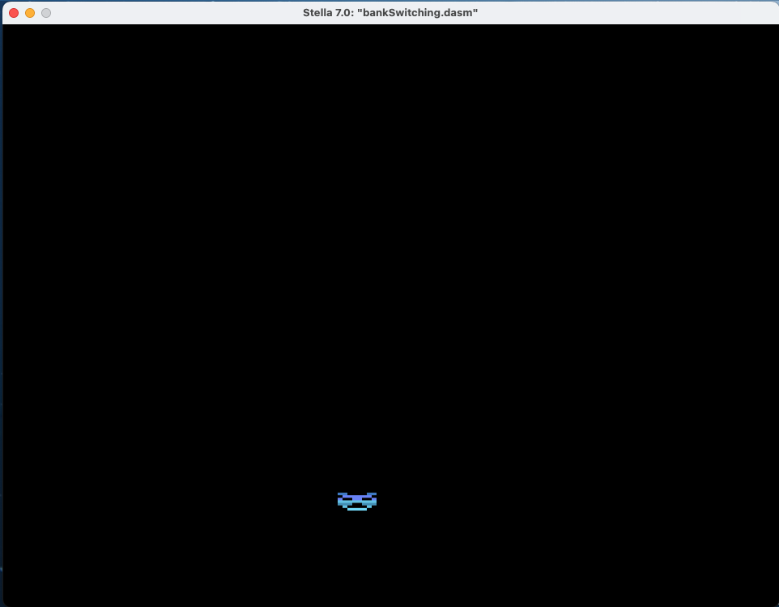

# atariBankSwitchingExample
A sample game showing how to do atari 2600 bankswitching

This project shows how to use the "trampolining" bankswitching as described in the book "Making Games For The Atari 2600" by Stephen Hugg

Bankswitching is a technique to get around the 4k limit of cartridge size on the Atari2600.

The theoritical game in this project has hit the 4k limit, and needs to be expanded to 8k to fit the game.
This game has 2 banks: the first one is the "game logic", and the second where the "drawing code" is located.
The game performs the underscan in Bank0, then switches to Bank1 and does the 192 lines of draw, then switches back to Bank0 to do the overscan.

